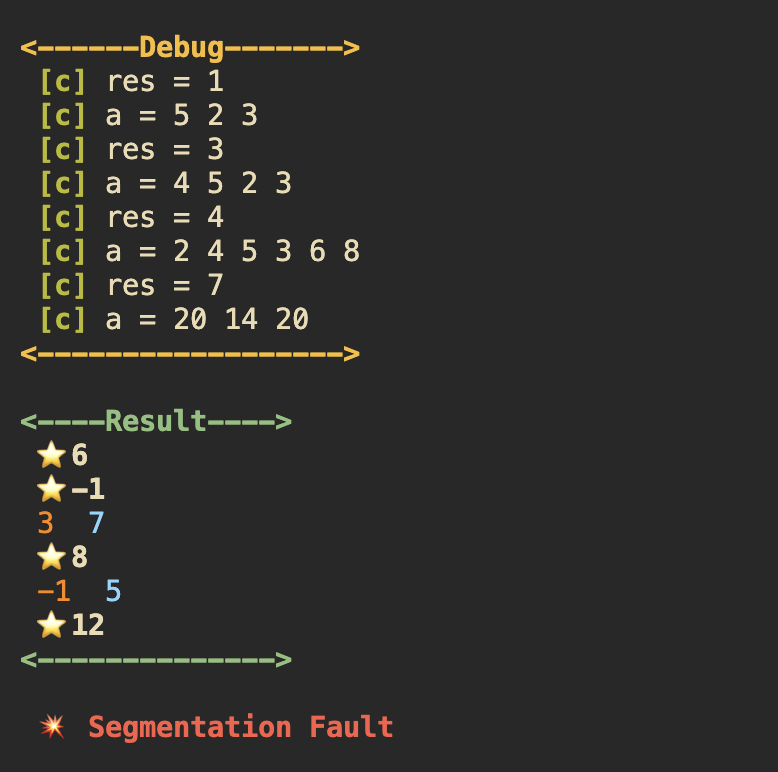
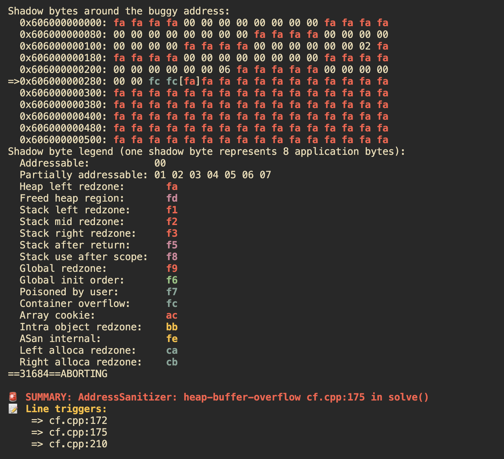

# tfy — Template For You 🚀

[](LICENSE)


A high-velocity, minimalist C++ testing pipeline engineered for competitive programming. `tfy` eliminates the overhead of manual compilation and output tracking by introducing automatic sample validation, real-time diffing, and integrated runtime diagnostics.

<table align="center" style="border-collapse: collapse; border: none;">
  <tr style="border: none;">
    <td align="center" style="border: none; padding: 10px;">
      <br/>
      <strong>tfy</strong>
    </td>
    <td align="center" style="border: none; padding: 10px;">
      <br/>
      <strong>tfy -d</strong>
    </td>
  </tr>
</table>
---

## ✨ Features

* **Dual Engine:** Instantly toggle between hyper-optimized execution builds (`-O3`) and deep analytical runs.
* **Granular Diffing:** Compares actual vs. expected streams line-by-line with sharp visual feedback.
* **Deterministic Sandboxing:** Automatic enforcement against hanging scripts (**TLE**) and heavy memory faults.
* **Hardwired Diagnostics:** Built-in hooks for AddressSanitizer (**ASAN**) to isolate out-of-bounds metrics and undefined behavior.
* **Native Architecture:** Pure shell implementation. Zero bloat, zero runtime dependencies. Fully compatible with Apple Silicon and modern Linux distributions.

---

## 📦 Installation

To deploy the binary globally on your system, execute the following block:

```bash
git clone [https://github.com/devh0211/tfy-pipeline.git](https://github.com/devh0211/tfy-pipeline.git)
cd tfy-pipeline
chmod +x tfy
sudo mv tfy /usr/local/bin/
```

---

## 🚀 Execution & Core Usage

Ensure that your source code file, an `input.txt` asset, and an `expected.txt` baseline target are present within your active working directory.

| Command | Optimization Profile | Operational Target |
| :--- | :--- | :--- |
| `tfy main.cpp` | **Release Mode (`-O3`)** | Standard runtime evaluation and sample verification. |
| `tfy -d main.cpp` | **Debug Mode (`-O0 + ASAN`)** | Active tracebacks for Segfaults, leaks, and assertions. |
| `tfy -t 5 main.cpp` | **Custom Deadline** | Manually sets execution ceiling (e.g., 5 seconds timeout). |

---

### 💡 Workflow Optimization
If you want to skip typing the filename entirely, update the default argument within the core script:

1. Locate the `tfy()` declaration wrapper in the source script.
2. Update the First line of the function as follows:
```bash
# Locate and modify this entry line:
local opt_debug=0 opt_tlimit=2 opt_src="main.cpp"
```
Once updated, you can drop the explicit target parameter entirely:
```bash
tfy        # Runs Release on main.cpp
tfy -d     # Runs Debug on main.cpp
tfy -t 5   # Runs main.cpp with 5s timeout
```

---

## ⚡ VS Code Keyboard Shortcuts (Highly Recommended)

Instead of typing commands manually into the terminal before every submission, you can bind `tfy` to hotkeys inside Visual Studio Code using macros.

### Setup Instructions
1. Open VS Code.
2. Open the Command Palette using `Cmd + Shift + P` (macOS) or `Ctrl + Shift + P` (Windows/Linux).
3. Type and select: **Preferences: Open Keyboard Shortcuts (JSON)**.
4. Paste the following configuration array into your `keybindings.json` file (if you already have existing shortcuts, append these entries inside your main outer brackets `[]`):

```json
[
    {
        "key": "cmd+alt+n",
        "command": "workbench.action.terminal.sendSequence",
        "args": {
            "text": "tfy \u000D"
        }
    },
    {
        "key": "cmd+alt+b",
        "command": "workbench.action.terminal.sendSequence",
        "args": {
            "text": "tfy -d \u000D"
        }
    },
    {
        "key": "cmd+alt+t",
        "command": "workbench.action.terminal.sendSequence",
        "args": {
            "text": "tfy -t "
        }
    }
]
```

### Hotkey Mapping Index
* **`Cmd + Alt + N`**: Instantly compiles and runs the **Release Pipeline** on your code target.
* **`Cmd + Alt + B`**: Instantly triggers the **Debug Engine** with AddressSanitizer active.
* **`Cmd + Alt + T`**: Prints `tfy -t ` to the terminal line, leaving your cursor active so you can immediately type a custom timeout integer.

*(Note: Linux users can substitute `"key": "ctrl+alt+..."` patterns if desired).*

---

## 🛠 Low-Level Spec

| Target Protocol | Active Flag Metrics | Trapped System Faults |
| :--- | :--- | :--- |
| **Release Pipeline** | `-std=c++23 -O3 -D_Alignof=alignof` | Time Limit Exceeded (`124`) |
| **Debug Engine** | `-std=c++23 -g -O0 -fsanitize=address,undefined` | Segfault (`139`), FPE (`136`), Abort (`134`) |

---

## 📝 License

Distributed under the terms of the open-source **MIT License**. For deep reference parameters, view the `LICENSE` document.
